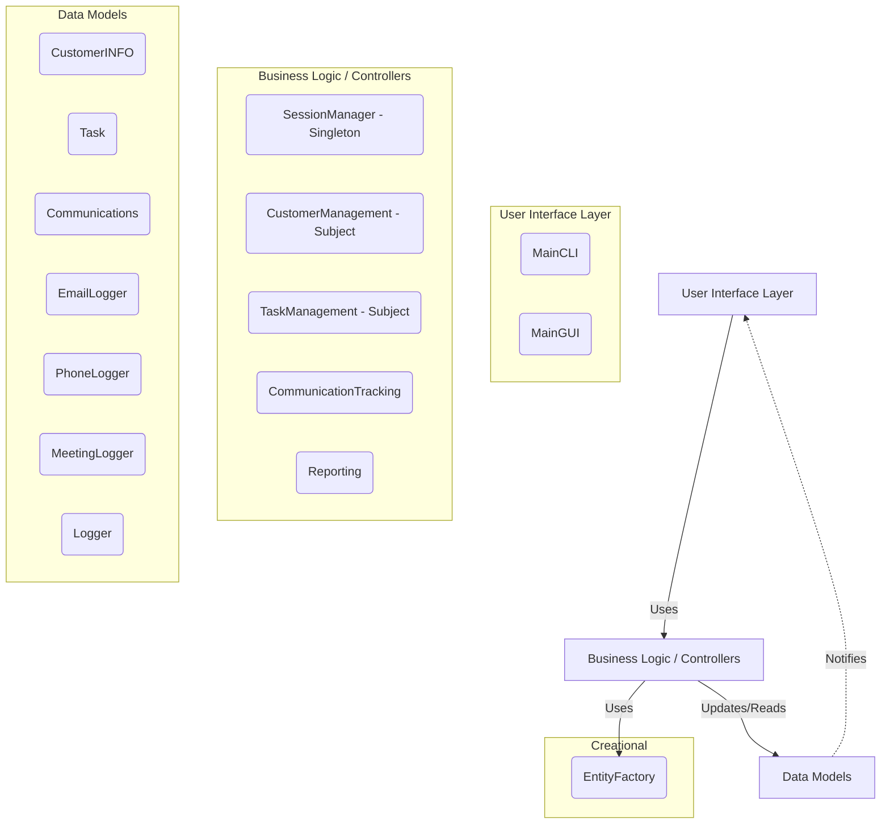
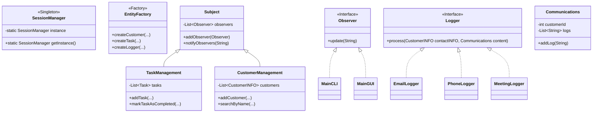

# CS1OPNU-CW1

**Module Code:** CS1OPNU
**Assignment report Title:** Project (Customer Relations Manager)
**Student Number (e.g. 25098635):** 33810887
**Actual hrs spent for the assignment:** 27
**Which Artificial Intelligence tools used (if applicable):** copilot

## Implementation Highlights

### Introduction
The Customer Relations Manager (CRM) is a robust Java application designed to manage customer profiles, track varied communication logs (emails, phone calls, meetings), and schedule follow-up tasks. Emphasizing Object-Oriented principles, the software demonstrates inheritance, composition, and layered design by cleanly separating data models from the CLI and GUI interfaces. To meet modern maintainability standards, the architecture integrates the Singleton, Factory, and Observer design patterns. These structural decisions allow dynamic instantiation of core components and real-time interface updates.

### Requirements
The implementation followed a prioritized strategy:
1. **Domain Models**: Set up `CustomerINFO`, `Communications`, and `Task` entities leveraging composition and inheritance.
2. **Software Patterns**: 
   - *Singleton*: Handle global application sessions securely.
   - *Factory*: Encapsulate logic for creating new tasks, communications, and customer entries.
   - *Observer*: Implement a publish-subscribe model in managers to notify UI controllers of updates asynchronously.
3. **Core Features**: Implement CRUD for customers, chronological communication tracking, and a 24-hour task deadline reminder system.
4. **User Interfacing**: Build distinct Command-Line and Graphical User Interfaces using the MVC layered approach.
5. **Quality Assurance**: Implement unit testing (both logic and GUI-focused).

### Design

#### System Architecture


#### Class Diagram


### Assumptions
- **Storage:** All entities are saved in-memory and will reset upon application restart.
- **Single Process:** The system relies on a single local user executing tasks without concurrent modification issues across different setups.
- **Reporting Boundaries:** Reports do not adjust to retroactive edits to tasks or completed status timestamps; they are statically aggregated at calltime.

---

## Setup Instructions
1. Ensure you have Java (JDK 8 or higher) installed on your system.
2. Clone or download the project repository and navigate to the project root.
3. All code is stored within the `src` folder.

## Usage Guide
Navigate to the root directory for standard operations.
1. **Compilation**: 
   Compile the Java files inside the `src` directory:
   ```bash
   cd src
   javac *.java
   ```
2. **Running the Application**: 
   Start the CLI by running:
   ```bash
   java MainCLI
   ```
   Or start the Graphical Interface:
   ```bash
   java MainGUI
   ```
3. **Running Tests**:
   For the most reliable testing without needing external JVM arguments, custom assertions are used in the main test methods. Run tests directly via:
   ```bash
   java UnitTests
   java GUIUnitTests
   ```
